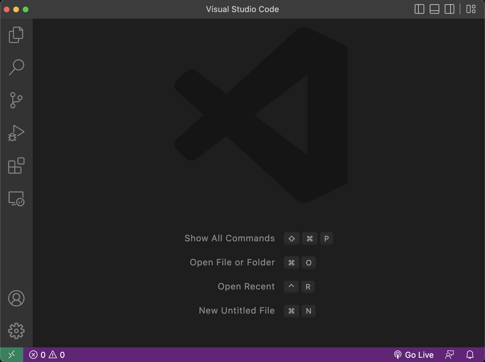
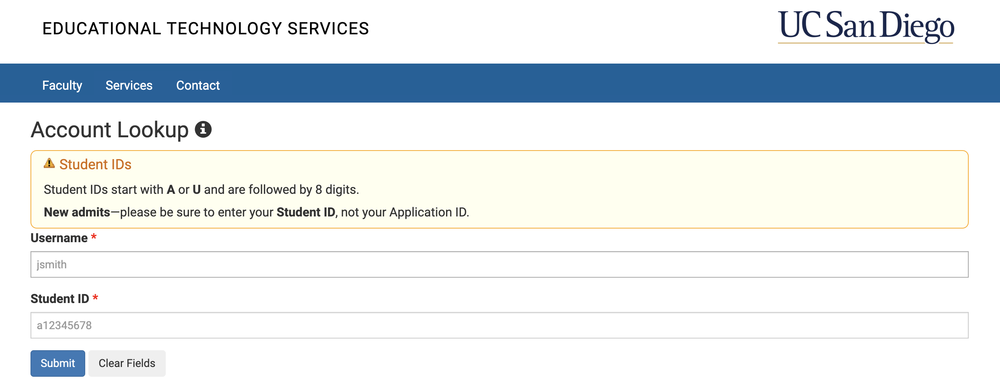
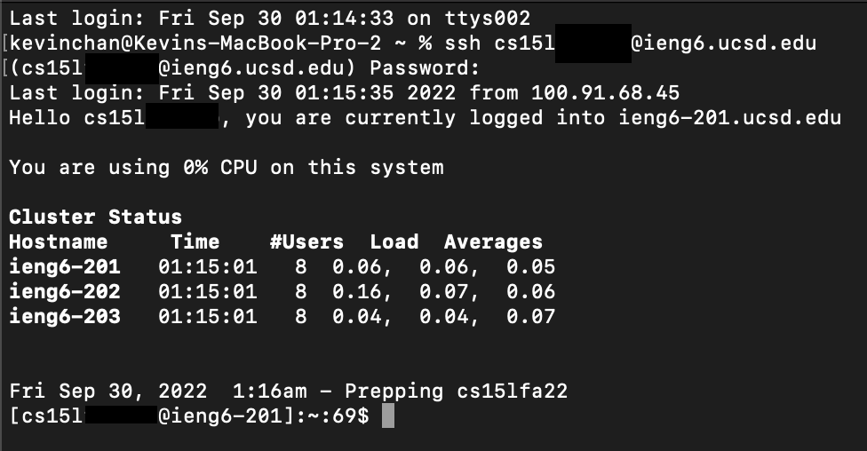

# Week 1: Lab Report 1
*By Kevin Chan, September 30, 2022*

## Table of Content
- [Week 1: Lab Report 1](#week-1-lab-report-1)
  - [Table of Content](#table-of-content)
  - [Install VSCode](#install-vscode)
    - [Step 1: Download VSCode for your operating system from Download VSCode](#step-1-download-vscode-for-your-operating-system-from-download-vscode)
    - [Step 2: Open VSCode](#step-2-open-vscode)
  - [Remotely Connecting to UCSD Servers](#remotely-connecting-to-ucsd-servers)
    - [Step 1: Get your account information](#step-1-get-your-account-information)
    - [Step 2: Connecting to Remote Server](#step-2-connecting-to-remote-server)
  - [Some Commands You Can Try](#some-commands-you-can-try)
  - [Moving Files with *scp*](#moving-files-with-scp)
  - [Setting an SSH Key](#setting-an-ssh-key)
  - [Optimze Remote Running](#optimze-remote-running)

***

## Install VSCode

It is always more efficient to use a good all-in one code editor that can run many different languages and scripts. VSCode is one such editor. Let's get started!

### Step 1: Download VSCode for your operating system from [Download VSCode](https://code.visualstudio.com)


Once the installer is downloaded, open it and follow the installation step.
### Step 2: Open VSCode
Open VSCode in your Application folder and begin programming in a great code editor!



***

## Remotely Connecting to UCSD Servers

Why do we want to connect to a secure shell, aka ssh? The remote server can be more powerfull and be in a different operating system that you want to use. We have the Linux operating system on the UCSD computers.

Let's get started by knowing how to connect to the SSH!

### Step 1: Get your account information

The very first step you need to do is to know your CSE 15L server account and set up your credentials.

Go to [Account Lookup](https://sdacs.ucsd.edu/~icc/index.php) and enter your UCSD credentials to log in. Explore the site and find your CSE 15L account username (looks like ex. *cs15lfa21ab*). Also, the website will also prompt you to change your password for the account (it takes time for the server to update your password). Keep a note of your credentials because you will need to use that shortly.



### Step 2: Connecting to Remote Server

Open terminal or command line on your computer. Run the following code (remember to substitute the 'username' with your own) :
```
ssh username@ieng6.ucsd.edu
```

It will look something like this:



Congrats! You successfully connected to the UCSD Remote Server. If your password isn't working, maybe the server hasn't been updated with your new password yet.

***

## Some Commands You Can Try

***

## Moving Files with *scp*

***

## Setting an SSH Key

***

## Optimze Remote Running