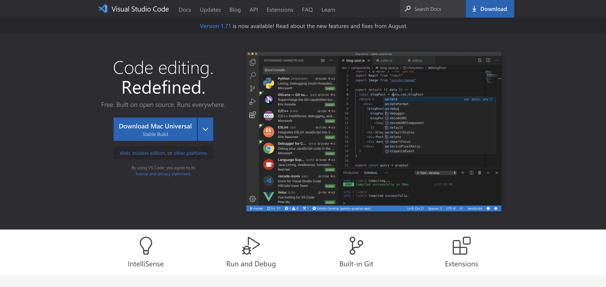

# Week 1: Lab Report 1
*By Kevin Chan, September 30, 2022*

## Content:
- [Week 1: Lab Report 1](#week-1-lab-report-1)
  - [Content:](#content)
  - [Install VSCode](#install-vscode)
    - [Step 1: Download VSCode for your operating system from Download VSCode](#step-1-download-vscode-for-your-operating-system-from-download-vscode)
    - [Step 2: Open VSCode](#step-2-open-vscode)
  - [Remotely Connecting to Secure Shell (SSH)](#remotely-connecting-to-secure-shell-ssh)
    - [Step 1:](#step-1)
  - [Some Commands You Can Try](#some-commands-you-can-try)
  - [Moving Files with *scp*](#moving-files-with-scp)
  - [Setting an SSH Key](#setting-an-ssh-key)
  - [Optimze Remote Running](#optimze-remote-running)

***

## Install VSCode

It is always more efficient to use a good all-in one code editor that can run many different languages and scripts. VSCode is one such editor. Let's get started!

### Step 1: Download VSCode for your operating system from [Download VSCode](https://code.visualstudio.com)

Once the installer is downloaded, open it and follow the installation step.
### Step 2: Open VSCode
Open VSCode in your Application folder and begin programming in a great code editor!

***

## Remotely Connecting to Secure Shell (SSH)

Why do we want to connect to a secure shell, aka ssh? The remote server can be more powerfull and be in a different operating system that you want to use. We have the Linux operating system on the UCSD computers.

Let's get started by knowing how to connect to the SSH!

### Step 1: 

***

## Some Commands You Can Try

***

## Moving Files with *scp*

***

## Setting an SSH Key

***

## Optimze Remote Running