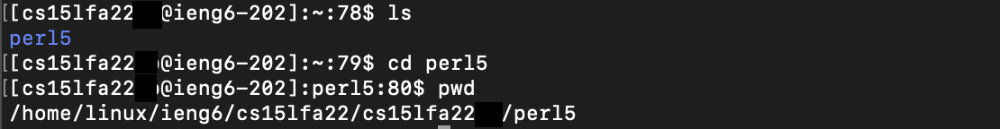

# Week 1: Lab Report 1
*By Kevin Chan, September 30, 2022*

## Table of Content
- [Week 1: Lab Report 1](#week-1-lab-report-1)
  - [Table of Content](#table-of-content)
  - [Install VSCode](#install-vscode)
    - [Step 1: Download VSCode for your operating system from Download VSCode](#step-1-download-vscode-for-your-operating-system-from-download-vscode)
    - [Step 2: Open VSCode](#step-2-open-vscode)
  - [Remotely Connecting to UCSD Servers](#remotely-connecting-to-ucsd-servers)
    - [Step 1: Get your account information](#step-1-get-your-account-information)
    - [Step 2: Connecting to Remote Server](#step-2-connecting-to-remote-server)
  - [Some Commands You Can Try](#some-commands-you-can-try)
    - [Print Working Directory (*pwd*)](#print-working-directory-pwd)
    - [List (*ls*)](#list-ls)
    - [Change Directory (*cd*)](#change-directory-cd)
    - [Make/Remove Directory (*mkdir / rmdir*)](#makeremove-directory-mkdir--rmdir)
    - [Create File (*touch*)](#create-file-touch)
    - [Remove File (*rm*)](#remove-file-rm)
    - [Concatenate (*cat*)](#concatenate-cat)
    - [Copy (*cp*)](#copy-cp)
    - [Exit (*exit or Ctrl-d*)](#exit-exit-or-ctrl-d)
  - [Copying Files with *scp*](#copying-files-with-scp)
  - [Setting an SSH Key](#setting-an-ssh-key)
    - [Step 1: Generate a Key](#step-1-generate-a-key)
    - [Step 2: Copy the Public Key to the Remote Server](#step-2-copy-the-public-key-to-the-remote-server)
  - [Optimze Remote Running](#optimze-remote-running)
    - [Using Tab](#using-tab)
    - [Using a Script](#using-a-script)

***

## Install VSCode

It is always more efficient to use a good all-in one code editor that can run many different languages and scripts. VSCode is one such editor. Let's get started!

### Step 1: Download VSCode for your operating system from [Download VSCode](https://code.visualstudio.com)


Once the installer is downloaded, open it and follow the installation step.
### Step 2: Open VSCode
Open VSCode in your Application folder and begin programming in a great code editor!


***

## Remotely Connecting to UCSD Servers

Why do we want to connect to a secure shell, aka ssh? The remote server can be more powerfull and be in a different operating system that you want to use. We have the Linux operating system on the UCSD computers.

Let's get started by knowing how to connect to the SSH!

### Step 1: Get your account information

The very first step you need to do is to know your CSE 15L server account and set up your credentials.

Go to [Account Lookup](https://sdacs.ucsd.edu/~icc/index.php) and enter your UCSD credentials to log in. Explore the site and find your CSE 15L account username (looks like ex. *cs15lfa21ab*). Also, the website will also prompt you to change your password for the account (it takes time for the server to update your password). Keep a note of your credentials because you will need to use that shortly.


### Step 2: Connecting to Remote Server

Open terminal or command line on your computer. Run the following code (remember to substitute the 'username' with your own) :
```bash
ssh username@ieng6.ucsd.edu
```

It will look something like this:


Congrats! You successfully connected to the UCSD Remote Server. If your password isn't working, maybe the server hasn't been updated with your new password yet.

***

## Some Commands You Can Try

It is very important to know your terminal commands! Here are some you can try!

### Print Working Directory (*pwd*)

```bash
#returns the current working directory 

pwd
```


### List (*ls*)

```bash
#returns the visible files in your directory

ls [directory]

#returns both the visible and hidden files in your directory

ls [directory] -a
```

### Change Directory (*cd*)

```bash
#change to your intended directory

cd [directory]

#returns to the parent directory

cd ..
```



### Make/Remove Directory (*mkdir / rmdir*)

```bash
#creates your intended directory

mkdir <directory>

#removes your intended directory

rmdir <directory>
```


### Create File (*touch*)

```bash
#creates your intended file


touch <file>
```

### Remove File (*rm*)

```bash
#removes your intended file

rm <file>
```

### Concatenate (*cat*)

```bash
#previous your intended file

cat <file> ... [more files]
```

### Copy (*cp*)

```bash
#copy your intended file to your intended destination

cp <source file/dir> <destination file/dir>
```

### Exit (*exit or Ctrl-d*)

```bash
#exits remote server (or current session)

exit
or Ctrl-d
```

***

## Copying Files with *scp*

If we want to copy a file from your local computer to the remote server (or vice versa), we need to use the *scp* instead of the *cp*, which only works in the same system.

```bash
scp <source file/dir> <destination file/dir>
```

Here is an example with UCSD Server:
```bash
#We have WhereAmI.java in the local computer, and we want to copy it to the remote server.

scp WhereAmI.java username@ieng6.ucsd.edu:

#We want to copy it back after some edits.

scp username@ieng6.ucsd.edu:~/WhereAmI.java ~
```


***

## Setting an SSH Key

### Step 1: Generate a Key

```bash
#Running this in your local will create an SSH Key

ssh-keygen
```

The terminal will prompt you which file to save the key in. Press enter for the default location. Next, it will prompt you to enter a passphrase for your key. Press enter for no passphrase.


Now, you can find *id_rsa* and *id_rsa.pub* in *~/.ssh* on your computer.

### Step 2: Copy the Public Key to the Remote Server

First, log in to your remote server. We want to copy the public key to the .ssh directory (which we need to make) on the server.

```bash
# This will create the .ssh directory to the server

mkdir .ssh
```

Next, exit the server. In local, we want to copy the public key to the directory through the *scp* command.

```bash
# This will copy the public key to the .ssh directory in the remote server

scp /Users/computer_username/.ssh/id_rsa.pub username@ieng6.ucsd.edu:~/.ssh/authorized_keys

# Use your own computer username and cs15l account username.
```


After doing this, you can enter or copy files to the remote server using *ssh* and *scp* without having to enter your password.


Congrats you have set up your ssh key! Now, you can access the remote server more efficiently.

***

## Optimze Remote Running
### Using Tab

### Using a Script