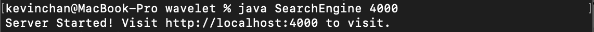
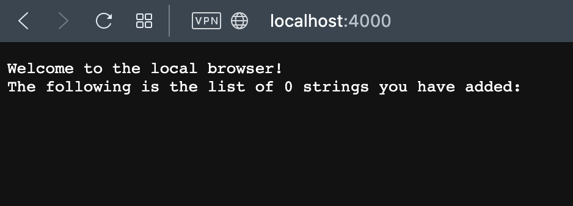
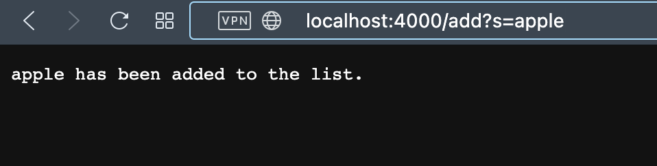
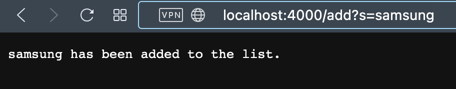
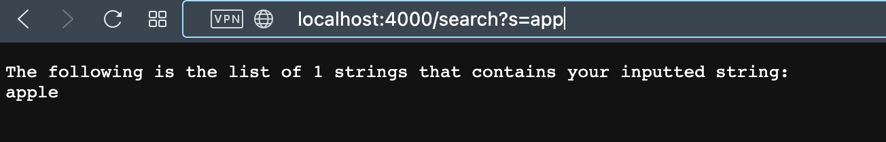

# Week 3: Lab Report 1

## Part 1: Simplest Search Engine

The following is my program:
```java
import java.io.IOException;
import java.net.URI;
import java.util.*;

class Handler implements URLHandler {
    // The one bit of state on the server: a number that will be manipulated by
    // various requests.
    int num = 0;
    ArrayList<String> string;
    
    public String handleRequest(URI url) {
        if(string == null) string = new ArrayList<>();
        
        if (url.getPath().equals("/")) {
            StringBuilder sb = new StringBuilder();
            sb.append("Welcome to the local browser! \n");
            sb.append("The following is the list of " + num +  " strings you have added: \n");
            for(String s : string){
                sb.append(s + "\n");
            }
            return sb.toString();
        } else if (url.getPath().equals("/add")) {
            String[] parameters = url.getQuery().split("=");
            if (parameters[0].equals("s")) {
                string.add(parameters[1]);
                ++num;
                return parameters[1] + " has been added to the list.";
            }
        } else if (url.getPath().equals("/search")) {
            String[] parameters = url.getQuery().split("=");
            if (parameters[0].equals("s")) {
                StringBuilder sb = new StringBuilder();
                int cnt = 0;
                sb.append("The following is the list of %d strings that contains your inputted string: \n");
                for(String s : string){
                    if(s.contains(parameters[1])){
                        sb.append(s + "\n");
                        ++cnt;
                    }
                }
                return String.format(sb.toString(),cnt);
            }
        }else {
            System.out.println("Path: " + url.getPath());
        }
        return "404 Not Found!";
    }
}

class SearchEngine {
    public static void main(String[] args) throws IOException {
        if(args.length == 0){
            System.out.println("Missing port number! Try any number between 1024 to 49151");
            return;
        }

        int port = Integer.parseInt(args[0]);
        Server.start(port, new Handler());
    }
}
```

***

### **Running the methods:**

First, to create a local server that uses our browser functions. We need to first run the commands that compile the java files and create the server:



Now, we can run the server on our browsers:



>1. handleRequest() is called with relevant value of the url path, which is "/".
>2. The method returns the list of currenet values (nothing because nothing has been added).

***

### **Using the *add* method**




>1. handleRequest() is called with relevant value of the url path value and the query value, which is "/add" and "s=apple" respectfully. A relevant value of the class is the content string list.
>2. The method finds the intended add value "apple" by splitting the query value.
>3. The value is added to the content string list *string*; {} -> {"apple"}.

***



>1. handleRequest() is called with relevant value of the url path value and the query value, which is "/add" and "s=samsung" respectfully. A relevant value of the class is the content string list.
>2. The method finds the intended add value "samsung" by splitting the query value.
>3. The value is added to the content string list *string*; {"apple"} -> {"apple", "samsung"}.

***

### **Using the *search* method**



>1. handleRequest() is called with relevant value of the url path value and the query value, which is "/search" and "s=app" respectfully. A relevant value of the class is the content string list.
>2. The method finds the intended search value "app" by splitting the query value.
>3. The substring value is searched in the content string list *string*, which has the strings {"apple", "samsung"}.
>4. The method returns all the strings that has the substring "app".

***

## Part 2: Symptoms and Failure-inducing Inputs

### **reverseInPlace()** in ArrayExamples

* **Failure-Inducing Input**
  * {1,2,3}

* **Symptom (the failing test output)**
  * Output: {3,2,3}
  * Expected: {3,2,1}

* **Bug (the code fix needed)**
  * The loop iterates through the array and changes the values that is needed later 

* **Connection between the Symptom and the Bug**
  * The loop overwrites the elements in the first half with the elements in the second half. 
  * When the elements in the second half want to copy the elements in the first half, it would just be copying itself.
  * A way to fix the bug is by making a copy of the orginal array and copy the values from that array, so we don't copy values that was changed.

### **append()** in LinkedListExample.java

* **Failure-Inducing Input**
  ```java
    LinkedList list = new LinkedList<>();
    list.append(1);
    list.append(2);
    list.append(3);
  ```

* **Symptom (the failing test output)**
  * Doesn't finish running.

* **Bug (the code fix needed)**
  * The while loop never ends because the ending condition is never satisfied.
  ```java
    while(n.next != null) {
        n = n.next;
        n.next = new Node(value, null);
    }  
    ```
  * n.next is created at every loop iteration; therefore, the ending condition n.next == null is never satisfied. 

* **Connection between the Symptom and the Bug**
  * When appending the third value into the linkedlist, the program started iterating through the while loop. However, since the while loop never ends, the program kept on creating new n.next and never finished running.
  * A way to fix the bug is by assinig n.next to a new Node after the loop ends finding the last node in the list.