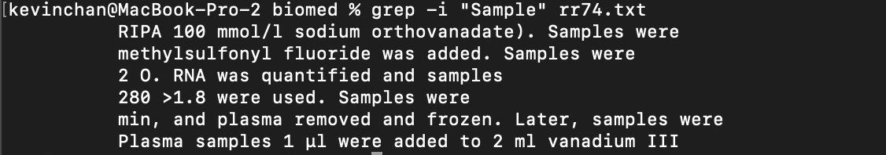
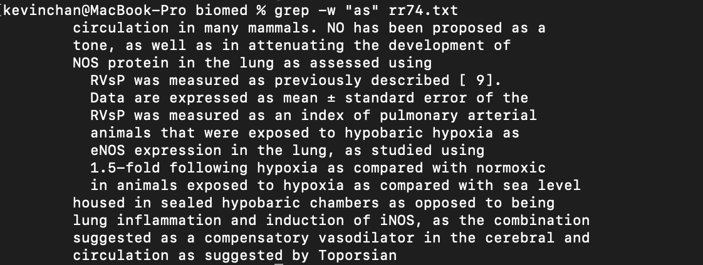

# Week 5: Lab Report 3

## grep

**grep** is used to find a given pattern inside a file. The command would return the line where the pattern is found.

### -c

We can use -c to return only the **count** of lines that match to the pattern. This is very useful when we only want to know how many lines contains the pattern.

> Example 1:
> 
> ```bash
> grep -c "three" rr74.txt
> ```
>
> 
>
> This example finds how many lines in rr74.txt has the pattern "three". 

> Example 2:
> 
> ```bash
> grep -c "as" rr74.txt
> ```
> 
> 
>
> This example finds how many lines in rr74.txt has the pattern "as". Notice that there are so many lines that has the pattern "as"; the **-c** option here is very useful, so the program doesn't print 157 lines.

> Example 3:
> 
> ```bash
> grep -c "apple" rr74.txt
> ```
> 
> 
>
> This example finds how many lines in rr74.txt has the pattern "apple".

### -i

We can use -i to **ignore case** on the pattern we are looking for. This is very useful when we want to search for lines with the pattern in all upper or lower cases.

> Example 1:
>
> ```bash
> grep -i "section" rr74.txt
> ```
> 
> 
>
> This example finds the lines in rr74.txt has the pattern "section", where the characters of the pattern can be in either upper or lower case. Notice that lines with "Section" is also printed.

> Example 2:
>
> ```bash
> grep -i "Sample" rr74.txt
> ```
> 
> 
>
> This example finds the lines in rr74.txt has the pattern "Sample", where the characters of the pattern can be in either upper or lower case. Notice that lines with the pattern "sample" is also printed.

> Example 3:
>
> ```bash
> grep -i "conclusion" rr74.txt
> ```
> 
> 
>
> This example finds the lines in rr74.txt has the pattern "conclusion", where the characters of the pattern can be in either upper or lower case. Notice that the program printed "Conclsion", with the first 'c' in the pattern capitalized.

### -w

We can use -w to find lines with **whole** words that match the pattern. This is very useful when we want to find exact words in the file that matches to the pattern.

> Example 1:
>
> ```bash
> grep -w "as" rr74.txt
> ```
> 
> 
>
> This example finds all the lines with whole word "as" in it. Therefore, lines with words like "gr**as**s" or "cl**as**s" will not be printed.

> Example 2:
>
> ```bash
> grep -w "As" rr74.txt
> ```
> 
> 
>
> This example finds all the lines with whole word "As" in it, instead of "as". Notice the difference between this example and the previous example. 

> Example 3:
>
> ```bash
> grep -w "section" rr74.txt
> ```
>
> 
>
> Notice that in Example 1 of **grep -i**, **-i "section"** returned lines with the pattern "section" regardless if it is a whole word; however, since no **whole words** in the file is "section", nothing is returned in this example.