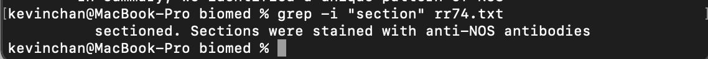

# Week 5: Lab Report 1

## less

**less** is used to view files without printing it all out on the terminal.

### -E

When we use -E, the file viewer will close on its own when we reach the end of the file.

### -M

When we use -M, the file viewer will also display the line we are on and the percentage we are at in the document.

### -N

When we use -N, the file viewer will display the line we are on on the side of the document.

***

## find
**find** is used to find files or directories in the current directory.

### -name [Name]

We can use -name to look for files with the name in the directory.

### -type [Type]

We can use -type to look for files or directories with the same type in the directory.

### -empty

We can use -empty to find for files or directories that are empty.

There are no empty files in biomed.

***

## grep

**grep** is used to find some pattern inside a file.

### -c

We can use -c to find the line numbers of the pattern we are looking for.

### -i

We can use -i to ignore case on the pattern we are looking for.

### -w

We can use -w to find lines with whole words that match the pattern.

