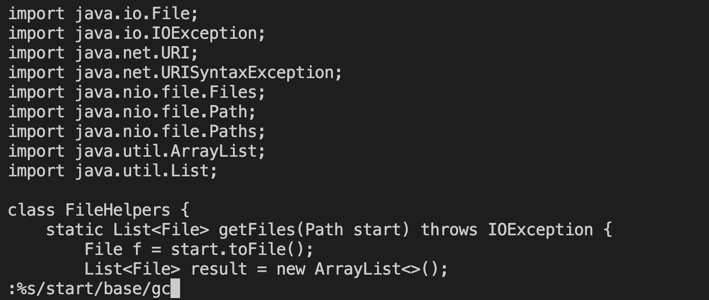
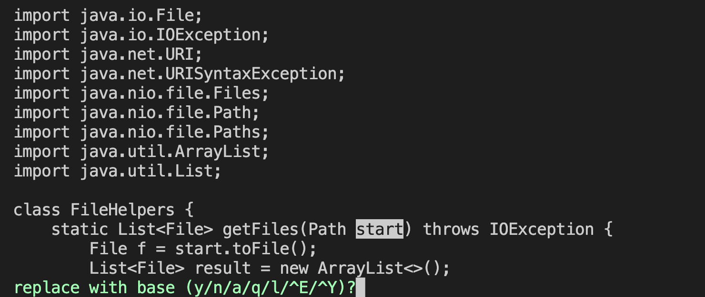
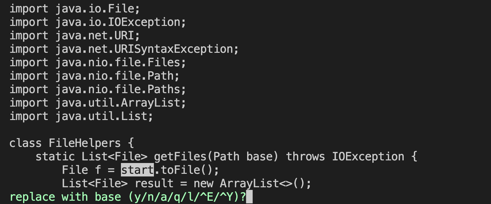
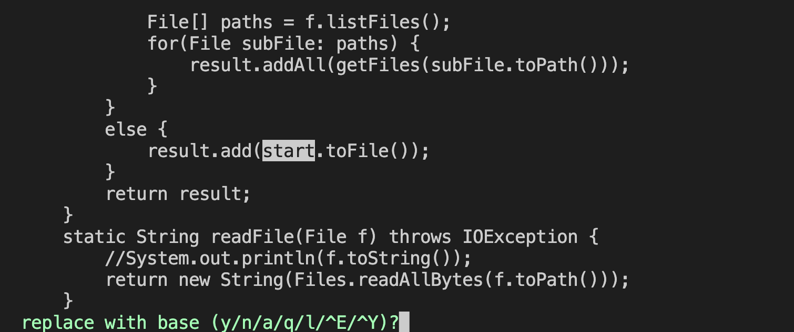
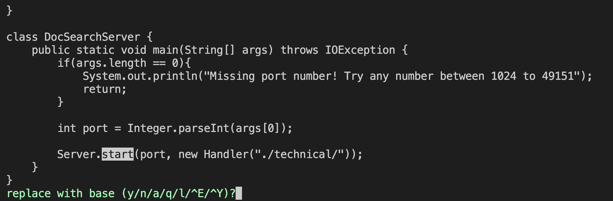
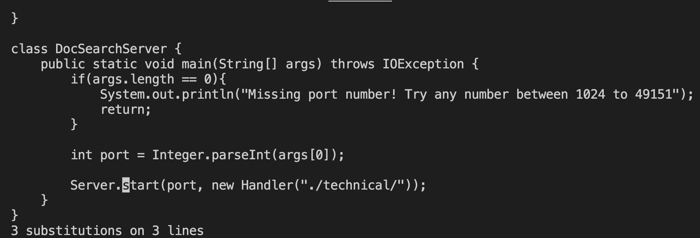

# Week 7: Lab Report 4

## Part 1:

I did the first task:

> Changing the name of the **start** parameter and its uses to **base**

My solution was (22 keys pressed):

```bash
:%s/start/base/gc <Enter>
y 
y
y 
n 
```

1. ```:%s/start/base/gc <Enter>```
   
   Before:
   

   After pressing Enter:
   
2. ```y```
   
3. ```y```
   
4. ```y```
   
5. ```n```
   


## Part 2:

### Total time it took me

1. On the local computer, I can finish eiditng the file with the task above in about 20 seconds using visual studio code. I can finish the uplodaing using the scp command using about 15 seconds. Logging onto the remote and running the program took me another 35 seconds. In total, it took me about 70 seconds.

2. Logging onto the remote took me about 20 seconds. Then, I edited for about 15 seconds using vim. Then running it took me about 5 seconds. In total, it took me about 40 seconds.

### Questions
* **Which of these two styles would you prefer using if you had to work on a program that you were running remotely, and why?**
  
  To me, it depends on how much the change will be. If there is little change, I would definetely prefer using the vim on the remote server because it is much faster to do so. However, if there is a lot to change, I would prefer to use Visual Studio Code on the local because I find it more convenient to use.

* **What about the project or task might factor into your decision one way or another? (If nothing would affect your decision, say so and why!)**

  Like I said in the previous question, if I need to make a small change to the program, I will use vim on the remote server. However, if I want to make a big change to the program, I will prefer to use Visual Studio Code on the local. Other than this, if the project cannot be ran on the local for reasons like memory usage or compatability, I will prefer to use vim on the remote server.