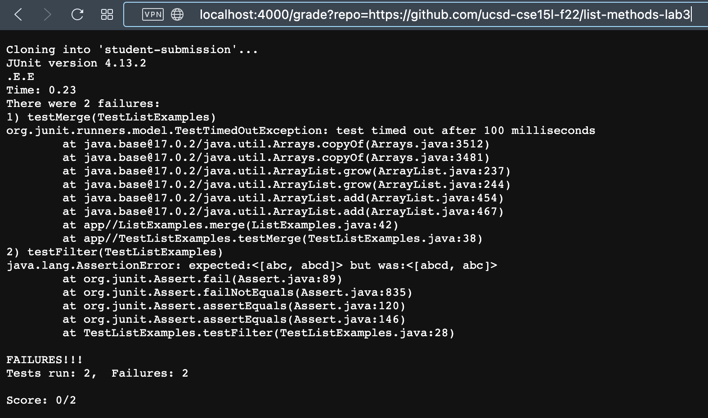
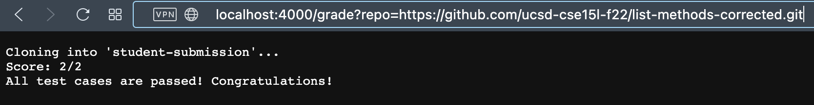
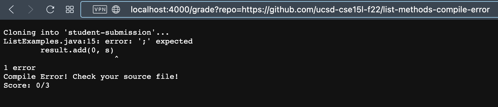

# Week 9: Lab Report 5

## grade.sh

```bash
#!/usr/bin/env bash

CPATH="$PWD/student-submission:$PWD/lib/hamcrest-core-1.3.jar:$PWD/lib/junit-4.13.2.jar"

rm -rf "student-submission"
git clone $1 "student-submission"

if [[ ! -f "student-submission/ListExamples.java" ]]
then
    echo "ListExamples.java doesn't exist"
    echo "Score: 0/3"
    exit 1
fi

cp *.java "student-submission/"
cd "student-submission/"

javac -cp $CPATH *.java

if [[ $? -ne 0 ]]
then
    echo "Compile Error! Check your source file!"
    echo "Score: 0/3"
    exit 1
fi 

java -cp $CPATH org.junit.runner.JUnitCore TestListExamples 1>result.txt
if [ $? -eq 0 ]
then
    echo "Score: 2/2"
    echo "All test cases are passed! Congratulations!"
    exit
else
    cat result.txt
    PASS=$(tail -c 3 result.txt | head -n 1)
    echo "Score: $[2-$PASS]/2"
    exit 1
fi
```

***

## Test runs

1. https://github.com/ucsd-cse15l-f22/list-methods-lab3, which has the same code as the starter from lab 3.
   
   

2. https://github.com/ucsd-cse15l-f22/list-methods-corrected, which has the methods corrected.
   
   

3. https://github.com/ucsd-cse15l-f22/list-methods-compile-error, which has a syntax error of a missing semicolon.
   
   

***

## Trace on the Second Run

**CPATH="\$PWD/student-submission:\$PWD/lib/hamcrest-core-1.3.jar:\$PWD/lib/junit-4.13.2.jar"**

> Declares the variable that will be used to find the class path to the libraries.

**rm -rf "student-submission"**

> Removes files in the student-submission directory. 
> 
> Returns no standard output nor standard error. 
> 
> The return code is zero.

**git clone $1 "student-submission"**

> Clones files in the github directory to the student-submission directory.
>
> Returns "Cloning into 'student-submission'..." to the standard ouput and no standard error.
>
> The return code is zero.

**if [[ ! -f "student-submission/ListExamples.java" ]]**
**then**
> Checks if ListExamples.java doesn't exist in the student-submission directory. 
> 
> The condition is false because it does exist in the directory.

**echo "ListExamples.java doesn't exist"**

**echo "Score: 0/3"**

**exit 1**
> The commands above do not run because the if condition is not satisfied.

**fi**
> End of the if block.

**cp \*.java "student-submission/"**
> Copies all java files from the current directory to the student-submission directory.
>
> Returns no standard output nor standard error. 
> 
> The return code is zero.

**cd "student-submission/"**
> Changes directory to the student-submission directory.
>
> Returns no standard output nor standard error. 
> 
> The return code is zero.

**javac -cp $CPATH \*.java**
> Compiles all java files in the current student-submission directory with class path $CPATH.
>
> Returns no standard output nor standard error. 
> 
> The return code is zero.

**if [[ $? -ne 0 ]]**
**then**
> Checks if the java files does not compile correctly. 
>
> The condition is false because the java files did compile correctly.

**echo "Compile Error! Check your source file!"**

**echo "Score: 0/3"**

**exit 1**
> The commands above do not run because the if condition is not satisfied.

**fi** 
> End of the if block.


**java -cp $CPATH org.junit.runner.JUnitCore TestListExamples 1>result.txt**
> Runs the TestListExamples class to grade the student submission. The standard output is redirected to result.txt
>
> Prints the standard output to result.txt:
> ```
> JUnit version 4.13.2
> ..
> Time: 0.004
> 
> OK (2 tests)
> 
> 
> ```
> and no standard error.
>
> The return code is zero.

**if [ $? -eq 0 ]**
**then**
> Checks if all the test cases are passed.
>
> The condition is true because the student submission passed both of the test cases.

**echo "Score: 2/2"**

> Outputs the score.
>
> Prints the standard output:
> ```
> Score: 2/2
> ```
> and no standard error.
>
> The return code is zero.

**echo "All test cases are passed! Congratulations!"**
> Outputs the congratulation phrase.
>
> Prints the standard output:
> ```
> All test cases are passed! Congratulations!
> ```
> and no standard error.
>
> The return code is zero.

**exit**

> Early exit after the grading is complete.
>
> Returns no standard output nor standard error. 
> 
> The return code is zero.

**else**

**cat result.txt**

**PASS=$(tail -c 3 result.txt | head -n 1)**

**echo "Score: \$[2-\$PASS]/2"**

**exit 1**

**fi**

> The else block and the commands above do not run because of an early exit.